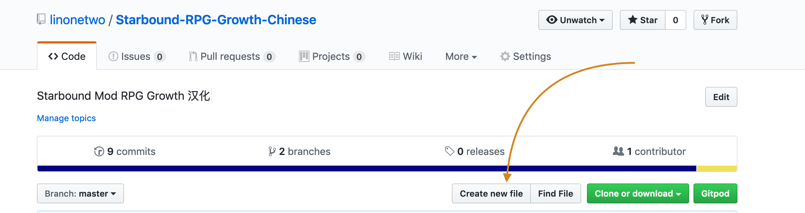

已弃坑，请采用 https://steamcommunity.com/sharedfiles/filedetails/?id=1929019607  ， Github 反馈地址 https://github.com/diskrubbish/Starbound-RPG-Growth-Chinese/commits

我最近精力集中在 https://github.com/tiddly-gittly/TiddlyGit-Desktop 和 https://github.com/linonetwo/Eternity-Foundation 上，精力有限不再维护此翻译脚本，如果有空我也会去上述新的翻译 Mod 里做贡献，希望大家跟着我一起过去！谢谢

# Starbound-RPG-Growth-Chinese

[Starbound Mod RPG Growth](https://github.com/IcyVines/Starbound-RPG-Growth) 汉化

下载地址：[Steam 创意工坊](https://steamcommunity.com/sharedfiles/filedetails/?id=1727230748) [非 Steam 直接下载](https://github.com/linonetwo/Starbound-RPG-Growth-Chinese/releases)

## 自动化翻译

在 clone 到本地后，装好 nodejs 环境，并在此文件夹里 `npm i` 过之后：

```shell
npm run download:source # 下载原版英文内容
npm run scan # 扫描当前翻译结果有哪些需要补充、哪些需要新增、哪些需要删除
npm run generate:overwrite-missing # 开始自动翻译
```

主要，需要创建一个 `.env` 文件，内写上百度翻译后台注册得到的两个值：

```env
TRANSLATION_APP_ID=20190429000292817
TRANSLATION_SECRET=zEah9krJpPiesWKhfSJG
```

### 误翻

可以在 scripts/tryTranslation.js 里纠正误翻

可以在 scripts/constants.js 里设定不需要翻译的 key

## Contribute

如果你在游戏过程中发现不当的翻译，或者有未翻译的内容，可以在 issue 里提出，或顺手作出修改：

直接点击 Create New File，然后在文件名那边黏贴 `translation/translationaffinities/affinityDescriptions.config.patch` 这样的文件名，就会自动创建文件夹和文件了。



这样修改的结果是放在你自己的仓库里的（防止用户恶意修改别人的仓库），然后你可以在我这边发起 Pull Request，让我去拉取你修改的结果，如果不懂操作上网搜搜视频吧！

[贡献者列表](https://github.com/linonetwo/Starbound-RPG-Growth-Chinese#contributor)

### 文件名（文件路径）格式

以 `translation` 开头，我们的翻译都放在这个文件夹里。中间的部分就看[待翻译列表](https://pastebin.com/2yQcm0Qv)，一般是 `tech/roguetech/roguetoxicsphere/roguetoxicsphere.tech` 这样。然后我们在最后面补上一个 `.patch`，这样 Starbound 就会用你创建的这个文件来修改源文件了。

### 文件格式

可以找个现有的例子看看，大概是这样：

```json
// ./translation/scripts/explorerglow/explorerglow.statuseffect.patch
[
  {
    "op": "replace",
    "source": "balkklsdlvasbsbfabab",
    "value": "探索与发现",
    "path": "/label"
  }
]
```

- op 是 Starbound 的 API，我们全都用 replace
- source **是我加的**，用于追踪对应的原文，**不存在于 Starbound 标准 API 中！**
- value 是翻译
- path 是原文在 JSON 中的字段的路径，MOD 里的原文都放在一个个 JSON 里，可能位于比较深的位置，用这个路径就能找到它，可以到 [Starbound Mod RPG Growth](https://github.com/IcyVines/Starbound-RPG-Growth) 找个例子看看

## Scripts

### `npm run download:source` 下载原文并解压到 `./source` 文件夹里

下载了原文才能扫描和比对。

### `npm run scan` 扫描原文与翻译的对应情况

会在这个文件夹里生成一个 `report.log` 文件，报告以下情况：

#### 扫描报告结果类型

- 翻译文件缺失：有新的待翻译的文件，或者是 MOD 结构发生改变了
- 源文件缺失：有没有什么翻译补丁文件没有对应的源文件，如果有就说明源 MOD 结构发生改变了
- 翻译条目缺失：补丁文件是有的，不过某个待翻译的词条没有对应的翻译
- 原文条目缺失：补丁文件是有的，之前也翻译过某个词条，不过这次这个词条在原文中不见了。也有可能是因为某个 key 加到了停止词表里，原因可能是这个 key （比如 lore ）尚未启用，运行时不存在，patch 了会报错。
- 原文条目不该翻译：这个 key 有可能是数据库 ID，所以不翻译（如果我猜错了请发 issue 告诉我）
- 译文内容无效：原文和译文相同（说明是放在那边占位等着翻译的，或者原文是「-」这样的占位符）

### `npm run unpack:mac` 解压压缩好的 Mod 文件

其实没什么用，主要是我总是忘记怎么手动解压，就保存在 script 里备忘吧。

### `npm run pack:mac` 打包可发布的 Mod 文件

调用了 `~/Library/'Application Support'/Steam/SteamApps/common/Starbound/osx/asset_packer`。

是 Mac 上才能运行的。

### `npm run generate:overwrite-missing` 自动生成缺失的翻译

使用百度翻译 API 自动生成大量低质翻译，注意这会把一大堆文件写入到 `translation` 文件夹里，和已有的翻译混在一起。

注意当前 git 工作区状态，随时准备回滚。

注意，会生成一些 `.patch.patch` 文件，这是对源 MOD 中的 `.patch` 文件的修改，请注意把它改回 `.patch`。如果发现有的文件是纯数据，并没有文本需要翻译（注意别把物品 ID 给翻译了，游戏会崩溃的），就把这个文件删掉（虽然下次它还会再次自动生成）。比如这几个（但我无法保证他们永远不需要翻译，所以没有直接自动无视它们）：

```log
  "翻译文件缺失 currencies.config.patch",
  "翻译文件缺失 damage/elementaltypes.config.patch",
  "翻译文件缺失 items/buildscripts/weaponabilities.config.patch",
  "翻译文件缺失 projectiles/physics.config.patch",
  "翻译文件缺失 quickbar/icons.json.patch",
```

### `npm run generate:test` 测试自动生成功能

把文件写入到 `translation-test` 文件夹里，比较方便删除生成的文件。

### `npm run try`

运行 `./scripts/try.js` 方便试用一些库。

## Contributor

感谢 [Runningsky](http://www.runningsky.top/localization/sdb/1115920474.html) 在 https://tieba.baidu.com/p/5581918647 分享了初始版本的汉化

目录结构参考了 https://github.com/ProjectSky/FrackinUniverse-sChinese-Project

## 常见问题

### 动态列表无法 Patch

https://github.com/IcyVines/Starbound-RPG-Growth/issues/6

```log
[Error] Could not apply patch from file /interface/RPGskillbook/RPGskillbook.config.patch in source: ../mods/translation.  Caused by: (JsonPatchException) Could not apply patch to base. (JsonPatchException) Could not apply operation to base. (TraversalException) No such key 'list' in pathApply("/gui/lorelayout/children/scrollArea/children/list/schema/listTemplate/title/value")
```

有一个 list 的 key 在静态文件里存在，在要 patch 的时候就不存在了（刚载入的时候没问题，一打开书就报两个错）。

虽然不知道具体原因，不过我猜测是因为 List 在运行时被 Lua 改变了，毕竟它是一个要滚动的 List 嘛，怎么能不变呢（。

请尽量不要去招惹带 `/list/` 的字段。

### 字符颜色不对

可能是翻译程序把一些 `^yellow;` 这样的颜色标记给破坏了，修复方法如下，全局搜索 `;` 或 `；` 然后把它们替换回英文即可：

```diff
-   "value": "职业是一项宝贵的资产，可以选择^黄色;1000像素。"
+   "value": "职业是一项宝贵的资产，可以选择^yellow;1000像素。"
```

### 如何上传 Mod 到 Steam？

修改 `RPG_Growth_Chinese.vdf` 里的 `<PATH_TO_THIS_REPO>` 为实际绝对路径，然后进入 steamcmd （没有就下一个 `mkdir steamcmd && cd steamcmd && curl -sqL "https://steamcdn-a.akamaihd.net/client/installer/steamcmd_osx.tar.gz" | tar zxvf -`），`login 账号 密码`，然后输入 `workshop_build_item <PATH_TO_THIS_REPO>/Starbound-RPG-Growth-Chinese/RPG_Growth_Chinese.vdf` 即可。

### 未开启的功能翻译了会报错

比如在 `ivrpgtext.config.patch` 里翻译了 `/lore/children/universe/title` 和 `/lore/title` 之后会报错：

```log
[Error] Could not apply patch from file /ivrpgtext.config.patch in source: ../mods/translation.  Caused by: (JsonPatchException) Could not apply patch to base. (JsonPatchException) Could not apply operation to base. (TraversalException) Could not find "title" to remove
```

删去 `/lore/title` 后会报错：

```log
[Error] Could not apply patch from file /ivrpgtext.config.patch in source: ../mods/translation.  Caused by: (JsonPatchException) Could not apply patch to base. (JsonPatchException) Could not apply operation to base. (TraversalException) No such key 'children' in pathApply("/lore/children/universe/title")
```

所以我把它们暂时移到了 `./translate/ivrpgtext.config.patch.lore.backup` ，并在 `./scripts/constants.js` 里面加上了 `lore` ，等启动了 Lore 功能后记得改回来。

详见：

- https://community.playstarbound.com/threads/manually-uploading-to-steam-workshop-with-linux-and-mac-and-windows.118872/
- https://community.playstarbound.com/threads/uploading-a-mod-onto-the-steam-workshop-step-by-step-how-to.118399/

### 翻译了数据库中的索引 ID

注意不要翻译 source 都是小写的，它们很有可能是游戏内使用的物品 ID、技能 ID 等，翻译了游戏就找不到它们了。

比如不小心把这个东西翻译了加到 `translation/specList.config.patch` 里：

```json
{
  "path": "/0/0/name",
  "op": "replace",
  "source": "paladin",
  "value": "圣骑士"
}
```

就会报错：

```log
[Error] Exception while calling script init: (LuaException) Error code 2, [string "/scripts/ivrpgMonsterNpcHook.lua"]:133: (AssetException) Error loading asset /specList.config
0   starbound                           0x000000010f0ce2b0 _ZN4Star13StarExceptionC2EPKcNSt3__112basic_stringIcNS3_11char_traitsIcEENS3_9allocatorIcEEEE + 128
1   starbound                           0x000000010f0ea7a7 _ZNK4Star6Assets8getAssetERKNS0_7AssetIdE + 359
2   starbound                           0x000000010f0e9d1f _ZNK4Star6Assets4jsonERKNS_6StringE + 159
```

因为这个 `paladin` 不是给人看的，而是给机器看的。又比如翻译了 `translation/classes/explorer.config.patch`：

```json
{
  "path": "/ability/name",
  "op": "replace",
  "source": "explorerglow",
  "value": "探索辉光"
}
```

就会报错：

````log
[Error] Exception while invoking lua function 'update'. (LuaException) Error code 2, [string "/scripts/ivrpgstatboosts.lua"]:339: (StatusEffectDatabaseException) No such unique stat effect '探索辉光'
0   starbound                           0x000000010c5942b0 _ZN4Star13StarExceptionC2EPKcNSt3__112basic_stringIcNS3_11char_traitsIcEENS3_9allocatorIcEEEE + 128
1   starbound                           0x000000010cb952f9 _ZN4Star29StatusEffectDatabaseException6formatIJNS_6StringEEEES0_PKcDpRKT_ + 89
2   starbound                           0x000000010cb9517f _ZNK4Star20StatusEffectDatabase18uniqueEffectConfigERKNS_6StringE + 255
3   starbound                           0x000000010cb7bd36 _ZN4Star16StatusController19addEphemeralEffectsERKNS_4ListINS_21EphemeralStatusEffectENSt3__19allocatorIS2_EEEENS_5MaybeIiEE + 422
```
